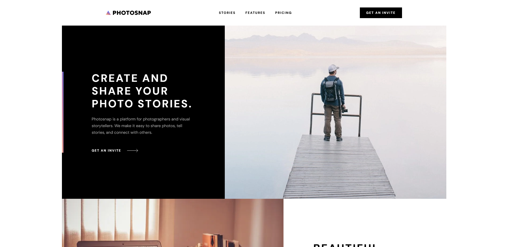

# Frontend Mentor - Photosnap Website solution

This is a solution to the [Photosnap Website challenge on Frontend Mentor](https://www.frontendmentor.io/challenges/photosnap-multipage-website-nMDSrNmNW). Frontend Mentor challenges help you improve your coding skills by building realistic projects.

## Table of contents

- [Overview](#overview)
  - [The challenge](#the-challenge)
  - [Screenshot](#screenshot)
  - [Links](#links)
- [My process](#my-process)
  - [Built with](#built-with)

## Overview

### The challenge

Users should be able to:

- View the optimal layout for each page depending on their device's screen size
- See hover states for all interactive elements throughout the site

### Screenshot

### Links

- Live Site URL: [Add live site URL here](https://your-live-site-url.com)

## My process

### Built with

- Semantic HTML5 markup
- Flexbox
- CSS Grid
- Mobile-first workflow
- [Next.js](https://nextjs.org/) - React framework
- [Tailwind CSS](https://tailwindcss.com/) - For styles
- [Headless UI](https://headlessui.dev/) - For building accessible components
- [TypeScript](https://www.typescriptlang.org/) - For type checking JavaScript
